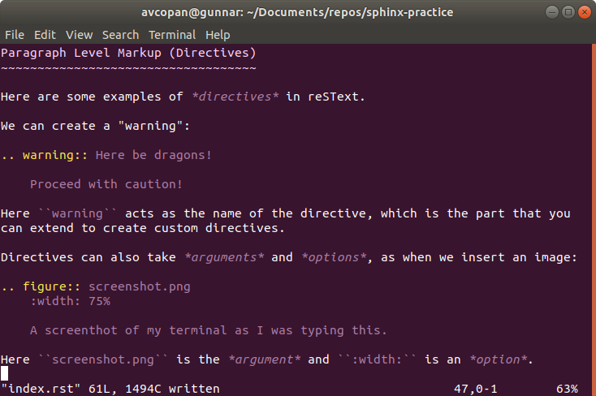

.. sphinx-practice documentation master file, created by
   sphinx-quickstart on Sat Jan  4 12:55:33 2020.
   You can adapt this file completely to your liking, but it should at least
   contain the root `toctree` directive.

sphinx practice notes
=====================

.. This is a comment.

The following are notes, primarily from `Eric Holscher's article`_.

.. _Eric Holscher's article: https://www.ericholscher.com/blog/2016/jul/1/sphinx-and-rtd-for-writers/

.. Beginning of notes.

Sphinx's reSText is powerful because the syntax can be extended.

It supports two types of extension:

    1. Paragraph level (with Directives)
    2. Inline level (with Interpreted Text Roles, or "roles" for short)

Paragraph Level Markup (Directives)
~~~~~~~~~~~~~~~~~~~~~~~~~~~~~~~~~~~

Here are some examples of *directives* in reSText.

We can create a "warning":

.. warning:: Here be dragons!

    Proceed with caution!

Here ``warning`` acts as the name of the directive, which is the part that you
can extend to create custom directives.

Directives can also take *arguments* and *options*, as when we insert an image:

    A screenthot of my terminal as I was typing this.

Here ``screenshot.png`` is the *argument* and ``:width:`` is an *option*. The
rest is the *content*, which in this case determines the figure caption.

You can write your own directives if you know some python.

Inline Level Markup (Interpreted Text Roles/"Roles")
~~~~~~~~~~~~~~~~~~~~~~~~~~~~~~~~~~~~~~~~~~~~~~~~~~~~

Here are some examples of *roles* in reSText.

.. code-block:: reStructuredText

    You can learn more about this in :rfc:`1984`.

    It is implemented in our code at :any:`hilib.greet_me`.

This generates the following:

.. topic:: \ 

    You can learn more about this in :rfc:`1984`.

    It is implemented in our code at :any:`hilib.greet_me`.

Notice that we were able to reference the function ``hilib.greet_me``, and this
took us to the appropriate place in the documentation. This will work in
generated PDFs as well.

I think you can also reference modules like so: :any:`hilib`.

.. toctree::
   :maxdepth: 2
   :caption: Contents:

   hilib/docs/index
   autoparse/docs/index

Indices and tables
==================

* :ref:`genindex`
* :ref:`modindex`
* :ref:`search`
